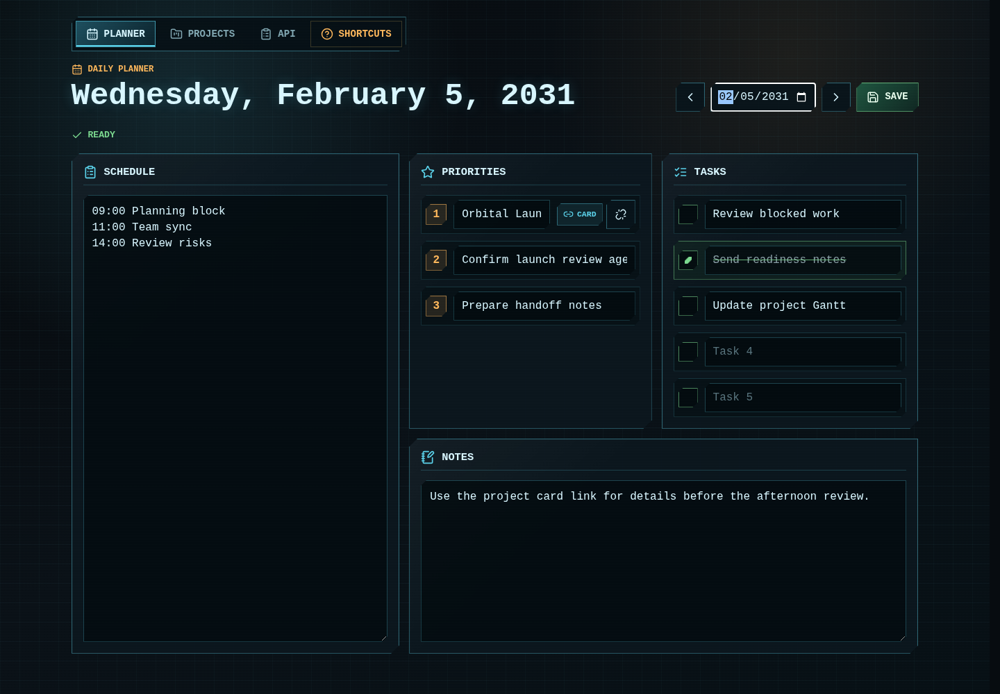
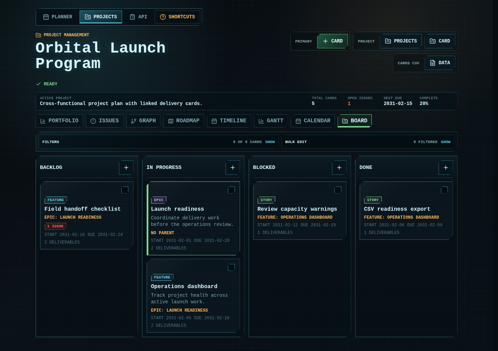
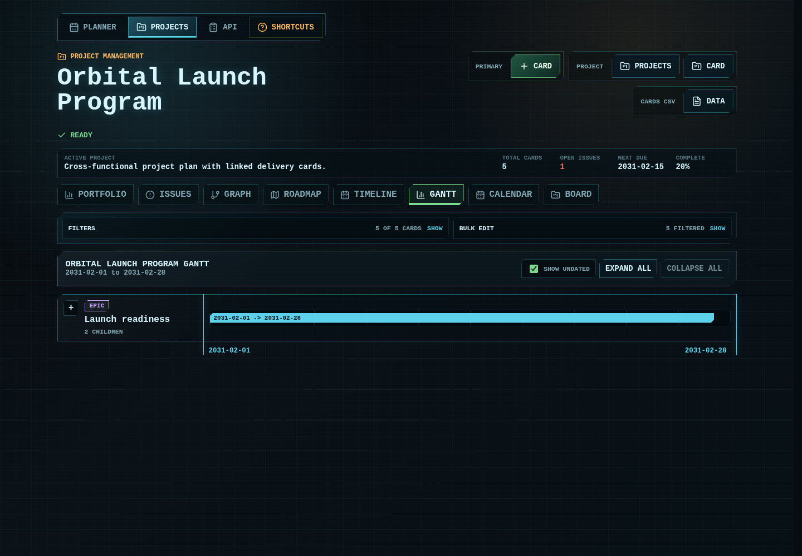
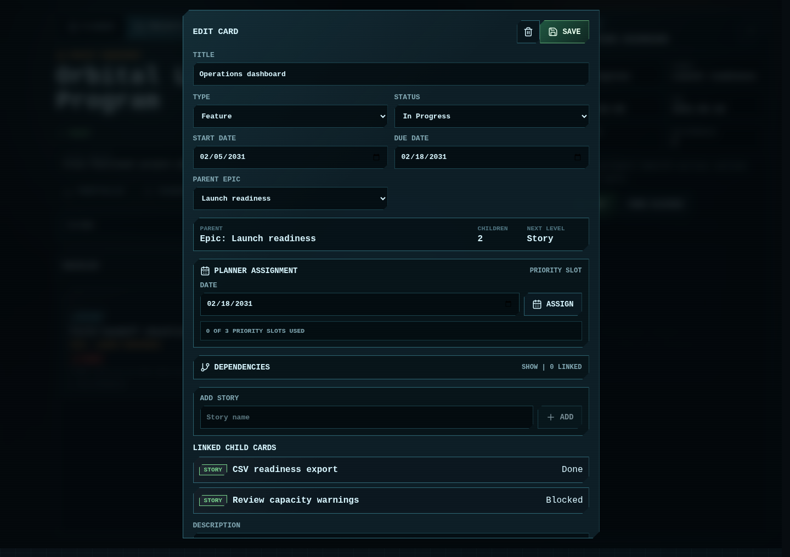
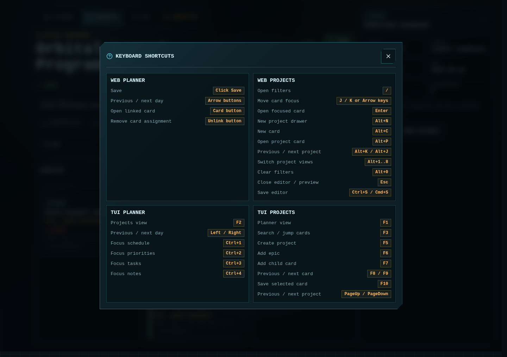

# Daily Planner

A simple daily planner and project management app with a Python [Textual](https://textual.textualize.io/) TUI and a React web frontend. The planner is inspired by the layout of the Sidekick planner and gives each day a schedule, priorities, tasks, and notes.

## Features

- Daily planner view with schedule, priorities, tasks, and notes sections
- Three daily priority fields
- Five task fields with completion checkboxes
- Previous/next day navigation
- Local SQLite persistence in `planner.db`
- Textual TUI and React web interfaces backed by the same SQLite databases
- Project management workspace with projects, epics, features, stories, subtasks, start dates, due dates, statuses, and deliverables
- Card-level project hierarchy: epics contain features, features contain stories, and stories contain subtasks
- Project cards with linked epics and quick epic creation
- Portfolio, roadmap, timeline, Gantt, calendar, and board views for project work
- Drag-and-drop Kanban status updates in the web project board
- Planner assignment warnings for full future days and already scheduled card priorities
- Card comments with Markdown preview and Mermaid/MMD fenced block support
- Project deletion from the Projects sidebar
- FastAPI JSON API for web access
- Docker Compose hosting with per-machine persisted SQLite databases
- Optional standalone executable build with PyInstaller

## Screenshots











## Quickstart

### Local Container Hosting

On another computer with Docker or Podman installed:

```bash
cp .env.example .env
just host-up
```

Open `http://localhost:8080`.

`just host-up` uses Docker Compose by default. To use Podman Compose instead:

```bash
just podman-up
```

Or set the compose command explicitly:

```bash
CONTAINER_COMPOSE='podman compose' just host-up
```

Docker-specific shortcuts are also available:

```bash
just docker-up
```

Each computer gets its own databases in that computer's local named volume, `daily_planner_data`. The container stores planner data at `/data/planner.db` and project data at `/data/project_mgmt.db`. To stop the app while keeping the databases:

```bash
just host-down
```

Use the matching engine-specific stop command if needed:

```bash
just docker-down
just podman-down
```

To intentionally remove that computer's hosted databases, stop with the reset recipe:

```bash
just host-reset
```

Change the host port by editing `.env`:

```bash
DAILY_PLANNER_PORT=8081
```

Without `just`, run the compose tool directly:

```bash
docker compose up --build
```

or:

```bash
podman compose up --build
```

### Local Development

From the repository root:

```bash
uv sync
npm --prefix web install
```

Run the web app:

```bash
just dev
```

Open `http://127.0.0.1:5173/` in your browser. Use the top tabs to switch between the daily planner and project management views. Press `Ctrl+C` in the terminal running `just dev` to stop both servers.

To run the terminal planner instead:

```bash
just tui
```

To see all task shortcuts:

```bash
just
```

## Requirements

- Python 3.13 or newer
- [uv](https://docs.astral.sh/uv/) for dependency management
- Node.js and npm for the React frontend
- Optional: [just](https://github.com/casey/just) for the included task shortcuts

## Getting Started

Install Python dependencies:

```bash
uv sync
```

Install web dependencies:

```bash
npm --prefix web install
```

Run the TUI planner:

```bash
just tui
```

Run the web app during development:

```bash
just dev
```

Then open the Vite URL shown in the terminal, usually `http://127.0.0.1:5173`.

The TUI and web planner both create or update `planner.db` in the directory where they are run. The TUI and web project manager both create or update `project_mgmt.db`. Set `PLANNER_DB_PATH` and `PROJECT_MGMT_DB_PATH` to override those paths.

For local container hosting, the app uses `/data/planner.db` and `/data/project_mgmt.db` inside the container and persists them in the local named volume `daily_planner_data`. Docker and Podman keep their own local volume stores, so each computer and container engine has separate data by default.

List available task shortcuts:

```bash
just
```

Run the Python test suite:

```bash
just test
```

Run the focused browser smoke tests. Install Playwright's Chromium runtime once on each development machine:

```bash
npx --prefix web playwright install chromium
just web-typecheck
just web-unit
just web-test
```

The frontend typecheck currently covers the typed API client and shared frontend contracts. The frontend unit tests cover extracted scheduling and hierarchy logic. The browser tests build the frontend, start an isolated local API server, and use temporary planner and project databases rather than your local application data.

Capture README screenshots from isolated demo data:

```bash
just screenshots
```

Screenshots are written to `docs/screenshots/`.

Continuous integration runs the same core checks on pushes to `main` and pull requests: Ruff, Python tests, frontend build, frontend typecheck, frontend unit tests, and the focused Playwright smoke tests with isolated databases.

## Backup And Restore

Export all planner entries, linked priority assignments, projects, cards, and card activity to a portable JSON file:

```bash
just backup
```

Restore replaces the current local planner and project data with the contents of that file:

```bash
just restore
```

Provide a filename when needed:

```bash
just backup backups/workstation.json
just restore backups/workstation.json
```

For a running hosted container, use the matching host recipes. `CONTAINER_COMPOSE='podman compose'` switches the same recipes to Podman:

```bash
just host-backup backups/hosted.json
just host-restore backups/hosted.json
```

## API

The web frontend talks to the FastAPI app through these endpoints:

| Method | Path | Description |
| --- | --- | --- |
| `GET` | `/api/planner/entries/{entry_date}` | Load a planner entry by `YYYY-MM-DD` date |
| `PUT` | `/api/planner/entries/{entry_date}` | Save a planner entry for that date |
| `PUT` | `/api/planner/card-assignments/{card_id}` | Assign or move a card into a dated planner priority slot |
| `DELETE` | `/api/planner/card-assignments/{card_id}` | Remove a linked card assignment from the planner |
| `GET` | `/api/projmgmt/projects` | List projects |
| `POST` | `/api/projmgmt/projects` | Create a project |
| `DELETE` | `/api/projmgmt/projects/{project_id}` | Delete a project and its cards |
| `GET` | `/api/projmgmt/projects/{project_id}/cards` | List project cards |
| `GET` | `/api/projmgmt/projects/{project_id}/issues` | List server-side dependency and hierarchy schedule warnings |
| `POST` | `/api/projmgmt/cards` | Create an epic, feature, story, or subtask |
| `PUT` | `/api/projmgmt/cards/{card_id}` | Update a card |
| `DELETE` | `/api/projmgmt/cards/{card_id}` | Delete a card |

## Project Cards

Project cards follow this hierarchy:

```text
Project
  Epic
    Feature
      Story
        Subtask
```

In the Projects tab, opening a project card shows linked epics and an inline field for adding epics without leaving the project card. Opening an epic, feature, or story card shows its parent, child cards, valid parent choices, and an inline field for adding the next child type. Type a child card name and press `Enter` or click `Add`; the child is added to the list and the parent card stays open so multiple child cards can be created quickly. The API enforces the same hierarchy, so a story must be tied to a feature and a subtask must be tied to a story.

Assigning a project card to a planner date creates a linked priority entry. Assigning the same card again moves that priority assignment to the new date. The card editor shows how many priority slots are already used for the selected date, warns when the day is full, and surfaces when multiple linked cards are already assigned to that date. In the web planner, the small linked-card control opens its project card and the adjacent unlink control removes the assignment.

Project hierarchy, dependency, and schedule-warning rules are implemented server-side in the project management service layer. The web UI keeps matching local domain helpers for responsive rendering, and the API exposes project issue results for clients that need the server as the source of truth.

## Platform Notes

The current platform remains Python, FastAPI, SQLite, React, and Textual. This is intentional: it keeps the app lightweight, local-first, and easy to host per machine. Postgres, a different TUI framework, or a larger frontend framework should only be revisited if multi-user hosting, heavier concurrency, or blocked TUI workflows become real requirements.

## Controls

Planner TUI shortcuts:

| Key | Action |
| --- | --- |
| `F2` | Switch to project management |
| `Left Arrow` | Save the current day and move to the previous day |
| `Right Arrow` | Save the current day and move to the next day |
| `Ctrl+1` | Focus the schedule section |
| `Ctrl+2` | Focus the first priority field |
| `Ctrl+3` | Focus the first task field |
| `Ctrl+4` | Focus the notes section |

`Ctrl+M` is also supported as an alternate project-management shortcut, but `F2` is more reliable across terminal emulators.

Entries are saved when changing days and when the app exits.

Project manager TUI shortcuts:

| Key | Action |
| --- | --- |
| `F1` | Switch to planner |
| `F5` | Create a project from the project name and description fields |
| `F6` | Add a backlog epic to the selected project |
| `F7` | Add the next child type to the selected card |
| `F3` | Focus card search; type text to filter or a card number to jump |
| `F10` | Save edits to the selected card |
| `PageUp` / `PageDown` | Select the previous or next project |
| `F8` / `F9` | Select the previous or next card |

The previous `Ctrl+P`, `Ctrl+N`, `Ctrl+E`, `Ctrl+A`, `Ctrl+F`, `Ctrl+Up` / `Ctrl+Down`, and `Ctrl+K` / `Ctrl+J` shortcuts remain available as alternates. In the TUI project view, select an epic and press `F7` to add a feature, select a feature and press `F7` to add a story, or select a story and press `F7` to add a subtask. Deliverables can be entered as a comma-separated list before adding a card.

The selected-card edit form updates as you move through cards with `F8` and `F9`. Use `F3` to filter cards by title, type, status, or parent name; enter a card number and press `Enter` to jump directly to that card. Edit the title, description, comments, status, start date, due date, parent number, or deliverables, then press `F10` to save. Status values are `backlog`, `in_progress`, `blocked`, and `done`. Dates use `YYYY-MM-DD`. Feature, story, and subtask cards require a parent number from the eligible parent list shown under the edit form.

Project manager web shortcuts:

Open the in-app shortcut reference with the `Shortcuts` button in the top navigation or by pressing `?`.

| Key | Action |
| --- | --- |
| `Alt+N` | Focus the new project field |
| `Alt+P` | Open the active project card |
| `Alt+C` | Create a new backlog epic card |
| `Alt+J` or `Alt+Down` | Select the next project |
| `Alt+K` or `Alt+Up` | Select the previous project |
| `Alt+1` | Create a backlog epic |
| `Alt+2` | Create an in-progress epic |
| `Alt+3` | Create a blocked epic |
| `Alt+4` | Create a done epic |
| `Esc` | Close the open card editor |
| `Ctrl+S` / `Cmd+S` | Save the open card editor |

Project shortcuts are ignored while typing in form fields. Deleting a project requires confirmation and removes its cards.

## Development

Run tests:

```bash
just test
```

Or without `just`:

```bash
uv run pytest
```

Format code:

```bash
just format
```

Lint code:

```bash
just lint
```

Build a standalone executable:

```bash
just build
```

The PyInstaller build uses `planner.spec` and includes `app_planner/ui.css` in the bundled app.

Build the React frontend:

```bash
just web-build
```

After building, the FastAPI app can serve the compiled frontend from `web/dist`.

Available `just` recipes:

| Recipe | Description |
| --- | --- |
| `just` | List all available recipes |
| `just test` | Run the Python test suite |
| `just web-typecheck` | Typecheck the TypeScript frontend foundation |
| `just web-unit` | Run frontend domain unit tests |
| `just web-test` | Run focused Playwright browser smoke tests using isolated databases |
| `just screenshots` | Capture README screenshots from isolated demo data |
| `just backup [file]` | Export local planner and project data to portable JSON |
| `just restore [file]` | Replace local data from a portable JSON backup |
| `just dev` | Run the API and React development servers together |
| `just host-up` | Build and run the hosted container app using `CONTAINER_COMPOSE`, defaulting to Docker Compose |
| `just host-down` | Stop the hosted container app |
| `just host-reset` | Stop the hosted container app and remove its local database volume |
| `just host-build` | Build the hosted container image |
| `just host-logs` | Follow hosted container logs |
| `just host-ps` | Show hosted container status |
| `just host-backup [file]` | Export data from the running hosted container |
| `just host-restore [file]` | Replace data in the running hosted container from backup |
| `just docker-up` | Build and run the Docker Compose hosted app |
| `just docker-down` | Stop the Docker Compose hosted app |
| `just docker-reset` | Stop Docker Compose and remove its local database volume |
| `just docker-build` | Build the Docker Compose hosted app |
| `just docker-logs` | Follow Docker Compose logs |
| `just podman-up` | Build and run the Podman Compose hosted app |
| `just podman-down` | Stop the Podman Compose hosted app |
| `just podman-reset` | Stop Podman Compose and remove its local database volume |
| `just podman-build` | Build the Podman Compose hosted app |
| `just podman-logs` | Follow Podman Compose logs |
| `just api` | Run the FastAPI development server |
| `just web` | Run the React development server |
| `just tui` | Run the terminal planner |
| `just web-build` | Build the React frontend |
| `just format` | Format Python code with Ruff |
| `just lint` | Lint and fix Python code with Ruff |
| `just build` | Build the standalone PyInstaller executable |
| `just clean` | Remove build artifacts |
| `just rebuild` | Clean and rebuild the standalone executable |

## Project Structure

```text
app_planner/
  api.py       FastAPI app, planner API, project routes, and static frontend serving
  database.py  SQLite setup and persistence helpers
  models.py    Pydantic models for planner entries and tasks
  ui.css       Textual styles
  ui.py        Textual application and keyboard handling
app_projmgmt/
  api.py       Project management API routes
  database.py  SQLite setup and persistence helpers for projects and cards
  models.py    Pydantic models for projects, cards, statuses, and card types
tests/
  test_database.py
  test_projmgmt_database.py
web/
  src/          React planner UI
justfile
planner.spec
pyproject.toml
```
